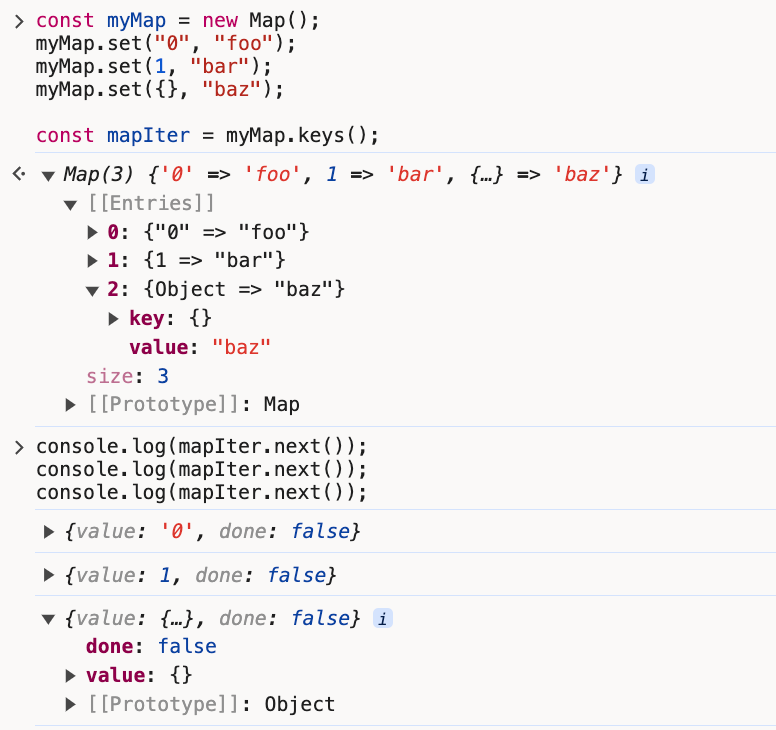

# 什么是 [LRU](https://zhuanlan.zhihu.com/p/34989978)

LRU 是一种缓存淘汰算法，用于管理缓存中的数据。算法思路是保留最近使用过的数据，淘汰最久未被使用的数据

需要实现的功能如下：

1. 设置缓存大小:初始化容量，当容量达到上线时，需要淘汰数据
2. 设置数据: 将数据写入缓存。需要判断缓存容量，并将当前的值设置为最新使用的
3. 获取数据: 从缓存中读取数据，并将当前的值设置为最新使用的
4. 淘汰数据: 缓存容量达到上线时，需要删除最久未使用的数据

代码逻辑如下:

```java
LRUCache lRUCache = new LRUCache(2);
lRUCache.put(1, 1); // 缓存是 {1=1}
lRUCache.put(2, 2); // 缓存是 {1=1, 2=2}
lRUCache.get(1);    // 返回 1
lRUCache.put(3, 3); // 该操作会使得关键字 2 作废，缓存是 {1=1, 3=3}
lRUCache.get(2);    // 返回 -1 (未找到)
lRUCache.put(4, 4); // 该操作会使得关键字 1 作废，缓存是 {4=4, 3=3}
lRUCache.get(1);    // 返回 -1 (未找到)
lRUCache.get(3);    // 返回 3
lRUCache.get(4);    // 返回 4
```

## JavaScript 中的 [Map](https://developer.mozilla.org/en-US/docs/Web/JavaScript/Reference/Global_Objects/Map)

Map.prototype.keys() 会返回一个 map 的 keys 对象的迭代器

```js
const myMap = new Map();
myMap.set('0', 'foo');
myMap.set(1, 'bar');
myMap.set({}, 'baz');

const mapIter = myMap.keys();

console.log(mapIter);

console.log(mapIter.next());
console.log(mapIter.next());
console.log(mapIter.next());
```



可以看到，map keys 迭代器返回的顺序，就是设置 key 的数据。越早设置，在迭代器中的位置越靠前

基于此，可以使用 Map 这种数据结构实现 LRU

## 代码实现

::: code-group
<<< ./code/lru.ts

::: code-group
